# Finance — visual decisions needed (2026-09-26)

Straightforward discrepancies were fixed in the application to match the agreed Figma frames
(FIGMA_PARITY.md §5). What remains below are differences that involve a usability or business
choice. **Each stays unresolved until you accept a resolution**; the screens they touch are
marked "Differs — decision needed" in FIGMA_PARITY.md.

Crops: Figma = the named node exported from page "15 — Finance · Cash & Budget"; app = the same
card from the running build on the local fixture (`tests/finance/visual/decision-crops.mjs`).

| ID | Screen | Figma | App | Difference | Impact on users | Recommendation |
|---|---|---|---|---|---|---|
| **D2** | FIN-02 Transactions — review panel | 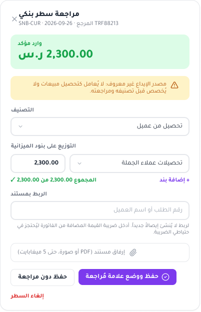 | 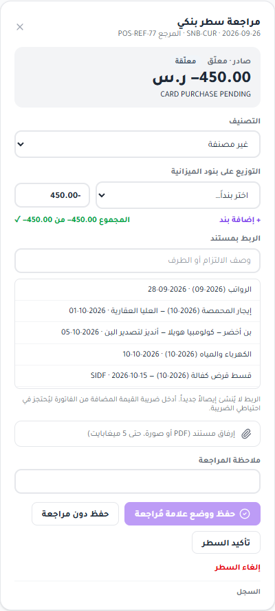 | The app panel adds four sections the frame does not draw: order match suggestions (three recent orders), "allocation from this receipt", a review-note field, and the line history. The panel is 886 px tall vs 624 px in the frame, which pushes the reconciliation card down. | Suggestions and allocation status are how a reviewer links a receipt and sees what it funded without leaving the panel; the note and history are the audit trail the brief requires. Removing them means more clicks and no in-place audit. | **Keep the app; add the four sections to FIN-02** (collapsed by default if height matters). |
| **D3a** | FIN-03 Allocation — categories | 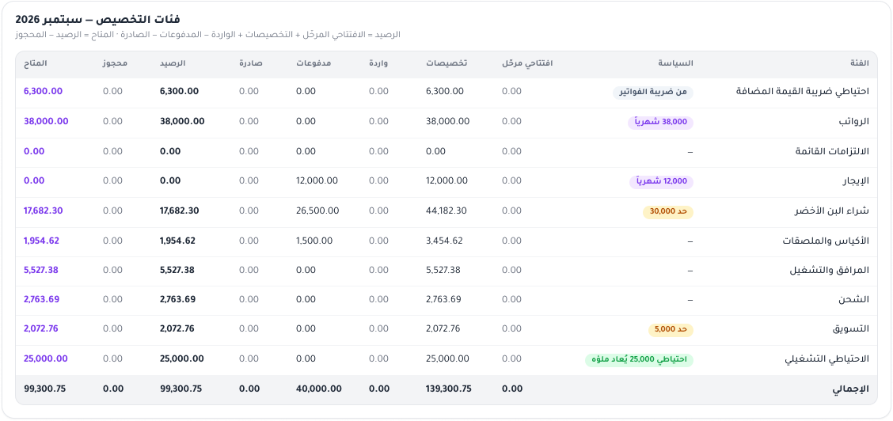 | 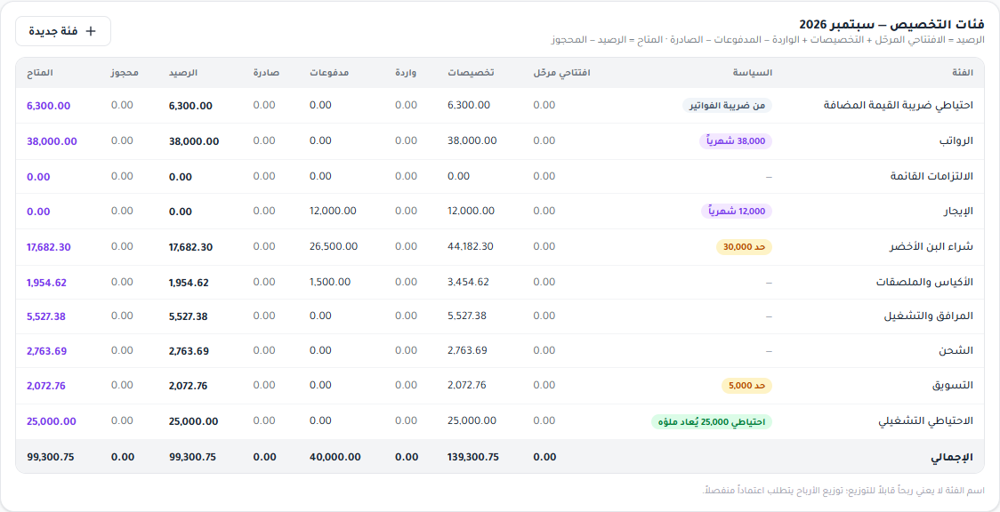 | "+ فئة جديدة" (new category) button in the table header; the frame has no way to create an allocation category anywhere on the page. | Without it, allocation categories can be created only through "Add suggested" in Settings. | **Keep the button; add it to FIN-03.** |
| **D3b** | FIN-03 Allocation — categories | (same crops) | (same crops) | App-only footnote under the table: "a category's name does not mean distributable profit…". | Reinforces acceptance 19 (no profit implied by cash figures). | **Keep; add to FIN-03.** Low stakes — acceptable to drop if you prefer the cleaner frame. |
| **D4a** | FIN-04 Budget — comparison table | 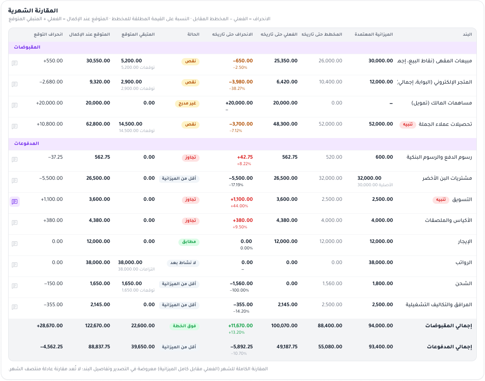 | 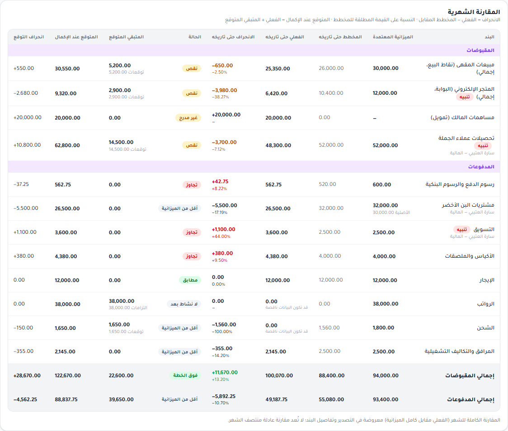 | Under some line names the app shows the line owner ("المالية — سارة العتيبي"), and under zero actuals "قد تكون البيانات ناقصة" (data may be incomplete). Rows are taller; the table card is 69 px longer (955 vs 886 px). | The owner is who explains a variance (brief: every line has an owner); the note stops a zero being read as "verified zero" while lines await review. | **Keep both; add to FIN-04.** Alternative: show the owner on hover only. |
| **D4b** | FIN-04 Budget — toolbar |  |  | The frame shows "إغلاق الفترة" (close period) to the preparer; the app shows it only to holders of `period_close`, which the preparer does not have. | Showing it to the preparer would offer an action the server refuses (403) — FIN-08's own rule is "an action not permitted is hidden". | **Correct the frame** (design error): hide it for this persona, or draw FIN-04 for an approver. |
| **D5** | FIN-05 Obligations — open obligations | 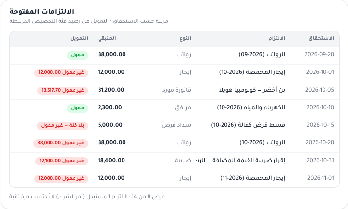 | 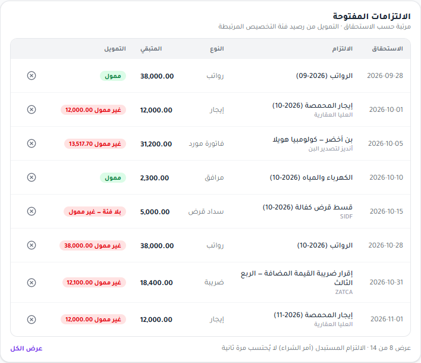 | App adds: a cancel (×) icon per obligation, the counterparty under the name, a "عرض الكل" (show all) link, and an Export button on the forecast card. | Cancel/supersede and export are required functions (brief §6, §9); the counterparty disambiguates two rents or two supplier bills. | **Keep; add to FIN-05.** |
| **D6** | FIN-06 Settings — accounts, branches, budget categories | 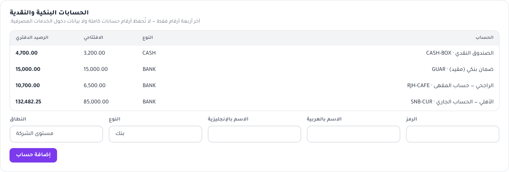 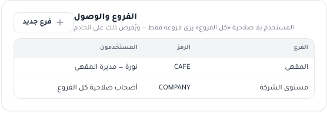 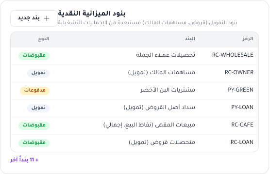 | 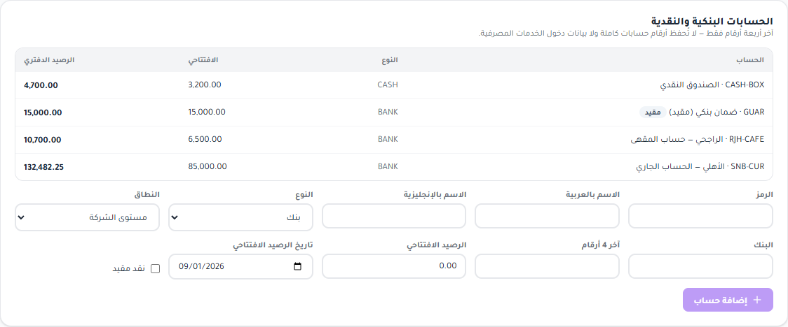 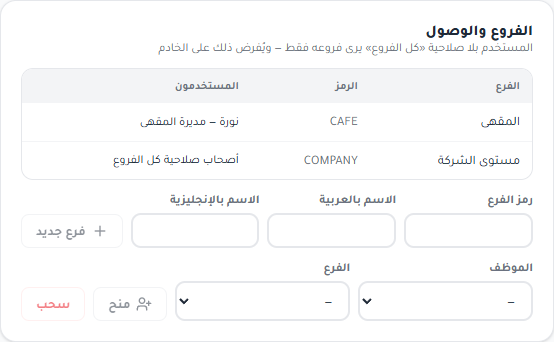 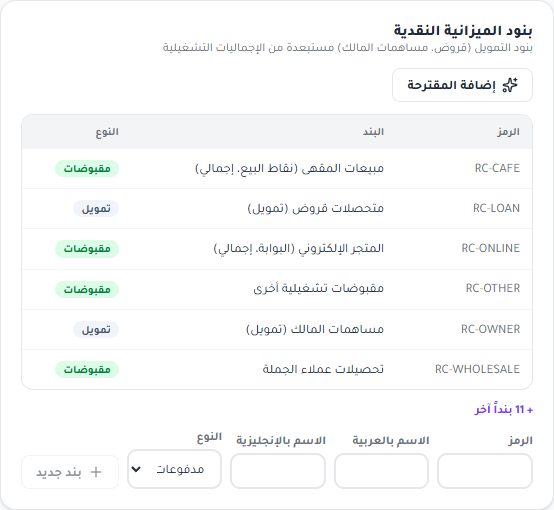 | Account form has five more fields (bank, last 4 digits, opening balance, its date, "restricted cash"); branches card has the employee-to-branch access controls; budget categories has "إضافة المقترحة" and an inline new-category form. The page is ~500 px longer. | These are the inputs the brief requires (opening balances, restricted cash, branch access). Without them Finance cannot be set up from the UI. | **Keep; redraw FIN-06** with these forms (can be split into sub-tabs if the page is too long). |
| **D7** | All dialogs and filters (e.g. FIN-07c) | 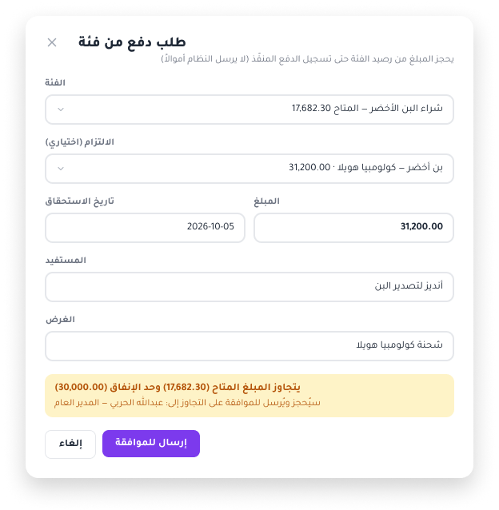 | 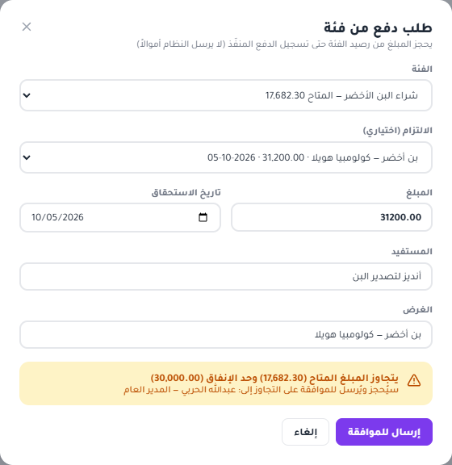 | `<select>`, date and file inputs are the browser's native controls: native chevron on the left, date shown in the browser's locale (`mm/dd/yyyy` / `09/26/2026`), "Choose File" label. The frame draws custom controls. | Native controls are accessible and keyboard-friendly by default; the date format can confuse Arabic users, and the look differs from the design. Affects the whole ERP, not only Finance. | **Decide ERP-wide.** Short term: accept native controls; medium term: one shared custom Select/DatePicker for all modules (not Finance-only). |

## Not decisions (recorded for completeness)

- **Shell** (header height 49 vs 46 px; header date in Arabic-Indic digits): existing code shared
  by every module, unchanged by Finance; the sales branch's shell renders Latin digits.
- **Data state** differences that the captures cannot reproduce exactly (queue order in FIN-07a,
  statement size in FIN-07b, chart axis maxima chosen automatically): not material.
